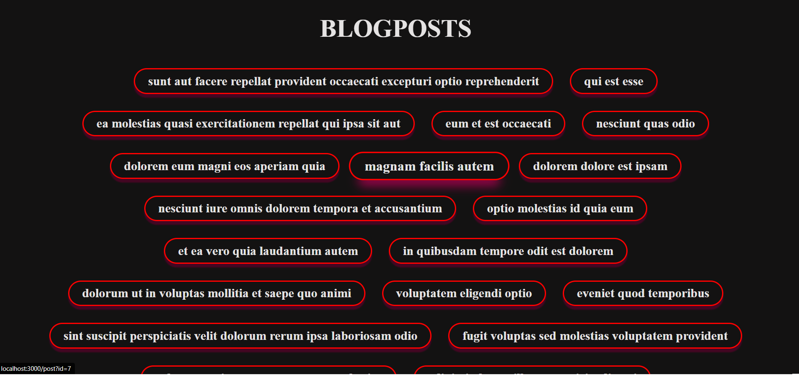
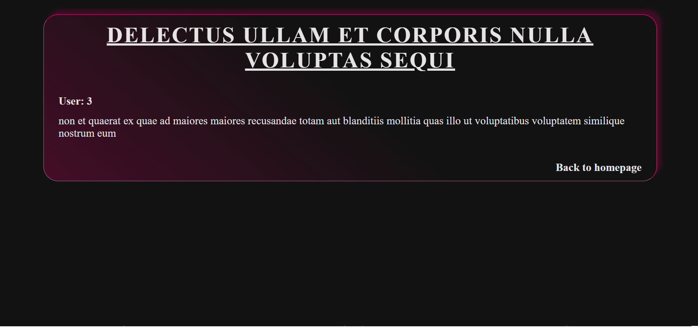

# **Next.js Router exercise**

## **Description**

### This exercise is made for Masterschool students to work the Router in Next.js 13.

### You get instructions to create a dynamic route using [JSON placeholder](https://jsonplaceholder.typicode.com/) and Next.js Router.

 

---

## **How to install Install**

> `npm install`

> `npm run start`

 

---

## **Exercises**

### **1. Exercise** (difficult: 🤣)

- **inside `/app/` folder**

  - create a new folder with the name "newSite"
  - inside "newSite" create the file `page.js`
  - `page.js` must return a Page component with some text of your choice

     

- **insdie `/app/page.js`**
  - create a new `li` element thats wrapping a `Link` element
  - the `Link` must be imported from "next/link"
  - provide the `Link` with a `href` that points to "/newSite"
