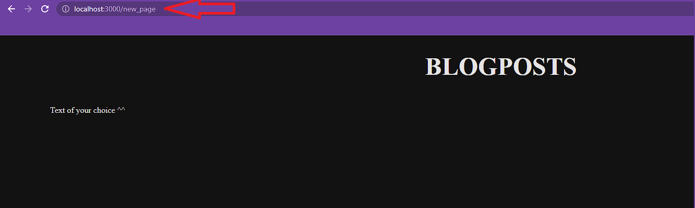
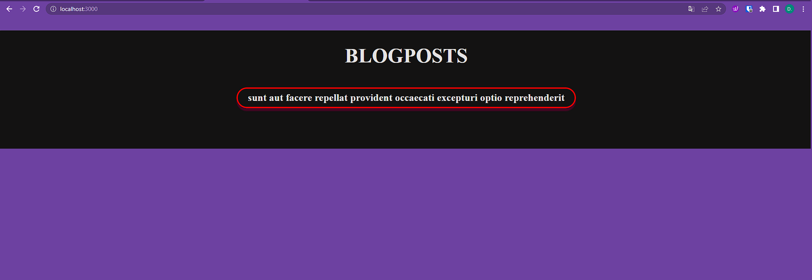
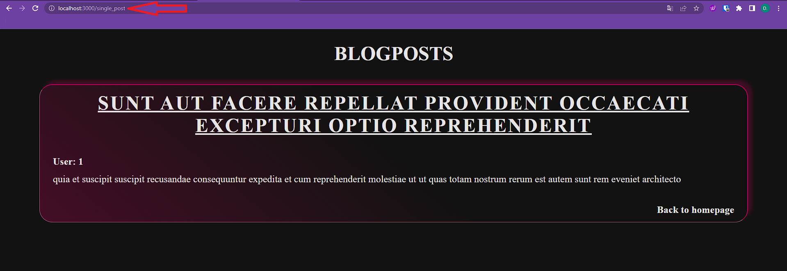

# **Next.js Router exercise**

## **Content**

 

- [How to install ](#how-to-install-install)

- [Exercise 1](#exercise-1-difficult-😀)

- [Exercise 2](#exercise-2-difficult-🤔)

- [Exercise 3](#exercise-3-difficult-🤯)

 

---

 

## **Description**

### This exercise is made for Masterschool students to work the Router in Next.js 13.

### You get instructions to create a dynamic route using [JSON placeholder](https://jsonplaceholder.typicode.com/) and Next.js Router.

 

 

---

## **How to install Install**

> `npm install`

> `npm run start`

---

 
 

## **Exercises**

### **Exercise 1 (difficulty: 😀)**

> **_Goal:create a static route and a link to it_**

- **inside `/app/`**

  - create a new **folder** with the name "new_page"
  - inside "new_page" create the file `page.js`
  - `page.js` must return a Page component with some text of your choice

     

- **insdie `/app/page.js`**
  - create a new `li` element inside the `ul` of the return statement thats wrapping a `Link` element
  - the `Link` element must be imported from "next/link"
  - provide the `Link` with a `href` that points to "/new_page"

### **Desired outcome**:

---

 
 

### **Exercise 2 (difficulty: 🤔 )**

> **_Goal: create a static Route with fetching data (server side) und using predefined components_**

- create a new route to /single_post

- **inside `/app/page.js`**

  - fetch a single post using `getPostWithId1()` from `/lib/API-Posts.js`
  - DONT'T use `useState` or `useEffect`, just the imported function and store it in a variable inside function scope of your Component
  - create a `Link` element thats wrapping a `LinkToPost` element wich is imported from `/components/LinkToPosts.jsx`
  - pass down your fetched data as `post` to the `LinkToPost` element

 

- **inside your new route**
  - use `getPostWithId1()` again to fetch the same post data.
  - inside the return create a `post` element wich is imported from `/components/Post.jsx`
  - pass down your fetched data as `post` to the `post` element

### **Desired outcome**:

---

 
 

### **Exercise 3 (difficulty: 🤯 )**

> **_Goal: Create dynamic routes with fetching data. The data should define the name of the route. Pull out information from the query to fetch diffrent data again._**

- **inside `/app/`**

  - create a dynamic route by adding a folder named "post" with [ ] surrounding the name and the needed files inside.
  - fetch all posts using the correct function from the provided `/lib/`
  - use the data to create for each entry a list item inside the `ul`
  - each `li` must contain a next link wich contains a `LinkToPost` component
  - provide your next link with a dynamic href comming from your `post.id`

    - the href should follow this pattern: `/posts?id=YOUR_POST_ID`

  - the `LinkToPost` component needs data to show up correctly

 

- **inside your dynamic route**
  - your component receives by default data as props
  - use the props to find a id you can use to fetch specific data later on
  - use the correct function from the provided `/lib/` to fetch a specific post
  - import the `Post` component to use it inside the return and provide it with your fetched data as prop.

 

### **Desired outcome**:

---

 
